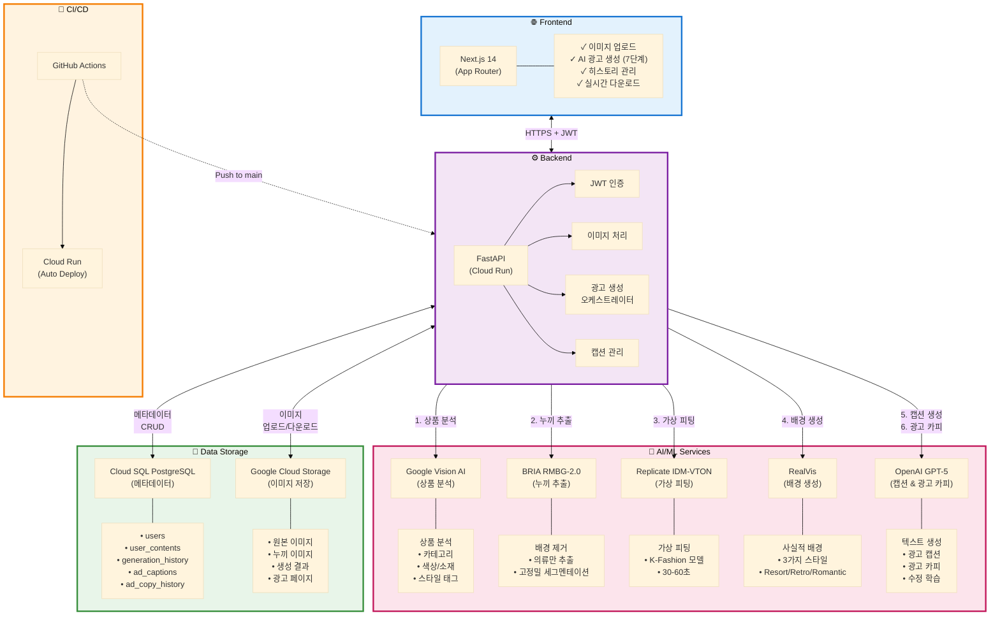
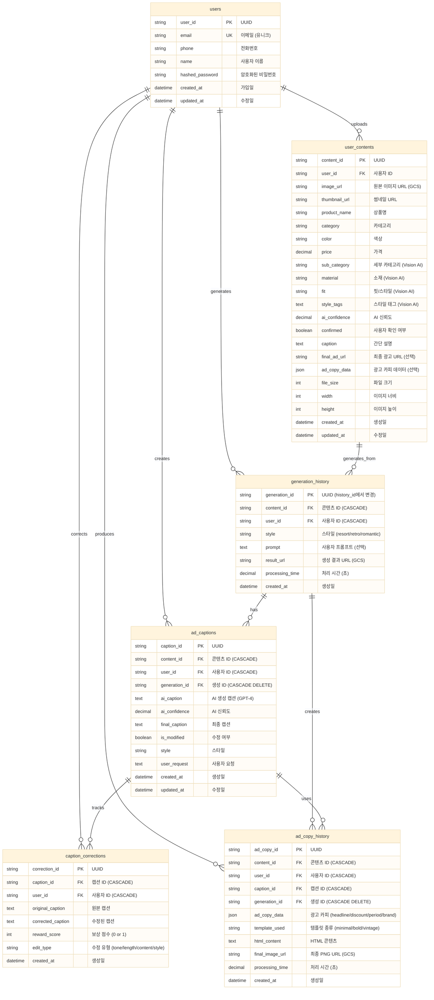

# AdGen_AI - 소규모 패션 쇼핑몰을 위한 AI 광고 자동 생성 서비스

---

## 서비스 시연 영상
<!-- TODO: 서비스 시연 GIF 또는 동영상 추가 -->


## 실시간 데모

- **프론트엔드**: [AdGen AI 웹앱](https://adgen-frontend-613605394208.asia-northeast3.run.app)
- **백엔드 API**: [API 문서](https://adgen-backend-613605394208.asia-northeast3.run.app/docs)

---

# 1. 프로젝트 개요

**프로젝트명**: **AdGen AI**

**핵심 아이디어**: 소규모 패션 쇼핑몰을 위한 **AI 기반 광고 자동 생성 서비스**로, 상품 이미지 한 장으로 **가상 피팅 모델 이미지 + 광고 캡션 + 최종 광고 페이지**까지 자동 생성

### **배경**

- 소규모 패션 쇼핑몰은 **마케팅 인력과 예산이 부족**하여 전문 모델 촬영이 어렵습니다.
- 상품 사진만으로는 소비자의 구매 욕구를 자극하기 어렵고, **광고 제작에 많은 시간과 비용**이 듭니다.
- 인스타그램, 스마트스토어 등 온라인 마케팅에서 **시각적으로 완성도 높은 광고**가 필수이지만, 소상공인이 직접 제작하기는 현실적으로 불가능합니다.

### **목표**

- **상품 이미지 1장 + 간단한 입력**만으로 **AI 가상 피팅 모델 이미지**를 생성합니다.
- **3가지 스타일(리조트, 레트로, 로맨틱) 배경**을 자동으로 생성하여 다양한 분위기의 광고를 제공합니다.
- **GPT-5 기반 광고 캡션**을 자동 생성하고, 사용자가 수정할 수 있도록 지원합니다.
- **최종 광고 페이지(HTML + PNG)**를 자동 생성하여 바로 다운로드 및 활용 가능하도록 합니다.

### **기대 효과**

- **AI 가상 피팅**으로 **모델 촬영 비용 절감** (건당 30만원 → 무료)
- **광고 제작 시간 단축** (2-3시간 → 2-3분, **95% 이상 감소**)
- **3가지 스타일 자동 생성**으로 A/B 테스트 및 다양한 채널 활용 가능
- **GPT-4 캡션 생성 + 수정 학습 시스템**으로 지속적인 품질 향상

---

# 2. ⚙️ 설치 및 실행 방법

---

## 🌐 웹 서비스 사용 (일반 사용자)

**AdGen AI를 바로 사용하세요!**

- 🎨 **데모 서비스**: [AdGen AI 웹앱](https://adgen-frontend-613605394208.asia-northeast3.run.app)
- 💡 **사용법**:
  1. 회원가입 및 로그인
  2. 상품 이미지 업로드 (드래그 앤 드롭 또는 파일 선택)
  3. 스타일 선택 (리조트/레트로/로맨틱)
  4. AI가 자동으로 가상 피팅 모델 이미지 생성 (약 30-60초)
  5. GPT-4가 광고 캡션 생성 (약 2-3초)
  6. 캡션 확정 (그대로 사용 또는 수정)
  7. 최종 광고 페이지 자동 생성
  8. PNG 이미지 다운로드
- ⚡ **생성 시간**: 약 1-2분 이내
- 🎯 **지원 스타일**: 리조트(Resort), 레트로(Retro), 로맨틱(Romantic)

---

## 💻 로컬 개발 환경 구축 (개발자용)

### Prerequisites
- Node.js 18+ 및 npm 설치
- Python 3.12+ 설치
- Git 설치
- Google Cloud SDK 설치 (선택, Cloud SQL 연결 시)
- 저장소 클론 완료

### 환경 설정

**1. 저장소 클론**
```bash
git clone https://github.com/Dongjin-1203/AdGen_AI.git
cd AdGen_AI
```

**2. 환경변수 설정**

백엔드 루트에 `.env` 파일 생성 (`.env.sample` 참고):
```bash
cd backend
cp .env.sample .env
# .env 파일을 열어서 실제 값을 입력하세요
```

**필수 환경변수:**
- `DATABASE_URL`: PostgreSQL 연결 URL
- `JWT_SECRET_KEY`: JWT 토큰 시크릿 키
- `GCS_BUCKET_NAME`: Google Cloud Storage 버킷명
- `GOOGLE_APPLICATION_CREDENTIALS`: GCP 서비스 계정 키 경로
- `GOOGLE_API_KEY`: Google Vision AI API 키
- `GOOGLE_MODEL_API_KEY`: Google Gemini API 키 ⭐
- `OPENAI_API_KEY`: OpenAI GPT-4 API 키
- `REPLICATE_API_TOKEN`: Replicate API 토큰

**선택 환경변수:**
- `GPU_SERVER_URL`: 자체 GPU 서버 사용 시
- `USE_GPU_SERVER`: GPU 서버 사용 여부 (기본: false)

**API 키 발급 방법:**
- [Google Cloud Console](https://console.cloud.google.com/apis/credentials) - Vision AI
- [Google AI Studio](https://aistudio.google.com/app/apikey) - Gemini
- [OpenAI API Keys](https://platform.openai.com/api-keys)
- [Replicate API Tokens](https://replicate.com/account/api-tokens)

**Frontend 환경변수** (`frontend/.env`):
```env
NEXT_PUBLIC_API_URL="http://localhost:8000"
```

**3. 백엔드 설정**
```bash
# 백엔드 폴더로 이동
cd backend

# 가상환경 생성 및 활성화 (선택)
python -m venv venv
source venv/bin/activate  # Windows: venv\Scripts\activate

# 의존성 설치
pip install -r requirements.txt

# 데이터베이스 마이그레이션 (Alembic 사용 시)
# alembic upgrade head

# 개발 서버 실행
uvicorn main:app --reload --port 8000
```

**4. 프론트엔드 설정**
```bash
# 프론트엔드 폴더로 이동
cd frontend

# 의존성 설치
npm install

# 개발 서버 실행
npm run dev
```

**5. 로컬 접속**

- 프론트엔드: http://localhost:3000
- 백엔드 API 문서: http://localhost:8000/docs

### 실행 방법

**전체 서비스 실행**
```bash
# Terminal 1: Backend
cd backend
uvicorn main:app --reload

# Terminal 2: Frontend
cd frontend
npm run dev
```

> ⚠️ **주의**: 
> - OpenAI API 및 Replicate API 사용 시 비용이 발생할 수 있습니다.
> - Google Cloud 서비스(Vision AI, Cloud SQL, Storage) 사용 시 비용이 발생합니다.
> - 로컬 테스트 시에는 실제 API 대신 Mock 데이터 사용을 권장합니다.
> - Cloud SQL 연결 시 Cloud SQL Proxy 사용을 권장합니다.

---

# 3. 📂 프로젝트 구조

---
```
AdGen_AI/
│
├── README.md
│
├── frontend/                    # Next.js 14 프론트엔드
│   ├── public/                  # 정적 파일
│   ├── src/
│   │   ├── app/                 # Next.js App Router
│   │   │   ├── page.tsx         # 랜딩 페이지
│   │   │   ├── login/           # 로그인 페이지
│   │   │   ├── signup/          # 회원가입 페이지
│   │   │   ├── upload/          # 이미지 업로드 페이지
│   │   │   ├── dashboard/       # AI 광고 생성 대시보드 ⭐
│   │   │   ├── history/         # 생성 히스토리 관리 ⭐
│   │   │   └── gallery/         # 업로드 갤러리
│   │   ├── components/          # 공통 React 컴포넌트
│   │   ├── lib/                 # 유틸리티
│   │   │   ├── api.ts           # API 클라이언트
│   │   │   └── store.ts         # Zustand 상태 관리
│   │   └── types/               # TypeScript 타입 정의
│   │       └── index.ts
│   ├── .env.local               # 프론트엔드 환경변수
│   ├── package.json
│   ├── next.config.js
│   └── tsconfig.json
│
├── backend/                     # FastAPI 백엔드
│   ├── app/
│   │   ├── main.py              # FastAPI 앱 진입점
│   │   │
│   │   ├── api/                 # API 엔드포인트
│   │   │   └── routes/
│   │   │       ├── auth.py      # 인증 (로그인, 회원가입, JWT)
│   │   │       ├── upload.py    # 이미지 업로드 및 Vision AI 분석
│   │   │       ├── ai_generate.py  # AI 광고 생성 ⭐
│   │   │       │   # - /generate-ad (GPU 서버)
│   │   │       │   # - /fashion-ad (GPU 서버)
│   │   │       │   # - /generate-ad-gemini (Gemini)
│   │   │       │   # - /generate-ad-replicate (Replicate) ⭐
│   │   │       ├── caption.py   # 광고 캡션 생성 및 관리 ⭐
│   │   │       ├── ad_copy.py   # 광고 페이지 생성 ⭐
│   │   │       └── history.py   # 생성 히스토리 조회/삭제 ⭐
│   │   │
│   │   ├── models/              # SQLAlchemy 모델
│   │   │   ├── schemas.py       # 핵심 모델
│   │   │   │   # - User (사용자)
│   │   │   │   # - UserContent (업로드 콘텐츠)
│   │   │   │   # - GenerationHistory (생성 기록) ⭐
│   │   │   └── caption_system.py  # 캡션 시스템 모델 ⭐
│   │   │       # - AdCaption (광고 캡션)
│   │   │       # - CaptionCorrection (수정 기록)
│   │   │       # - AdCopyHistory (광고 페이지 기록)
│   │   │
│   │   ├── db/                  # 데이터베이스
│   │   │   └── base.py          # DB 세션 관리
│   │   │
│   │   ├── core/                # 핵심 설정
│   │   │   └── storage.py       # GCS 업로드/다운로드
│   │   │
│   │   └── services/            # 비즈니스 로직
│   │       ├── generation/      # AI 생성 서비스
│   │       │   ├── gemini_generator.py     # Gemini 이미지 생성
│   │       │   ├── replicate_vton.py       # IDM-VTON 가상 피팅 ⭐
│   │       │   └── __init__.py
│   │       └── gpu_client.py    # GPU 서버 클라이언트 (선택)
│   │
│   ├── config.py                # 환경 설정
│   ├── requirements.txt         # Python 패키지
│   ├── .env                     # 환경변수 (gitignore)
│   └── .env.sample              # 환경변수 템플릿
│
└── docs/                        # 프로젝트 문서 (선택)
    ├── architecture.md
    └── api_reference.md
```

## 주요 디렉토리 설명

### Frontend (`/frontend`)
- **Next.js 14 기반**: App Router 사용, TypeScript 적용
- **주요 페이지**:
  - `/dashboard`: AI 광고 생성 워크플로우 (7단계)
  - `/history`: 생성 히스토리 관리 (삭제, 다운로드)
  - `/upload`: 이미지 업로드 및 Vision AI 분석
- **상태 관리**: Zustand (전역 인증 상태)
- **스타일링**: Tailwind CSS

### Backend (`/backend`)
- **FastAPI**: RESTful API 제공
- **SQLAlchemy ORM**: PostgreSQL (Cloud SQL) 연동
- **JWT 인증**: 토큰 기반 사용자 인증

### 핵심 API 엔드포인트 (`/backend/app/api/routes`)

#### **1. ai_generate.py** - AI 광고 생성
```python
POST /api/v1/generate-ad-replicate
# Replicate IDM-VTON으로 가상 피팅 모델 이미지 생성
# 입력: content_id, style, model_index, prompt
# 출력: history_id, result_url, processing_time
```

#### **2. caption.py** - 광고 캡션 생성
```python
POST /api/v1/caption
# GPT-4로 광고 캡션 자동 생성
# 입력: content_id, generation_id, user_request
# 출력: caption_id, ai_caption, ai_confidence

POST /api/v1/caption/confirm
# 캡션 확정 (수정 여부 기록)
# 입력: caption_id, final_caption
# 출력: is_modified, reward_score
```

#### **3. ad_copy.py** - 광고 페이지 생성
```python
POST /api/v1/ad-copy
# HTML 광고 페이지 생성 및 저장
# 입력: caption_id, user_request
# 출력: ad_copy_id, html_content, processing_time

POST /api/v1/render-image
# HTML을 PNG 이미지로 렌더링
# 입력: ad_copy_id
# 출력: image_url, processing_time
```

#### **4. history.py** - 히스토리 관리
```python
GET /api/v1/history/{user_id}
# 사용자별 생성 히스토리 조회
# 출력: 히스토리 목록 (최신순)

DELETE /api/v1/history/{history_id}
# 히스토리 삭제 (CASCADE DELETE)
# 관련 AdCaption, AdCopyHistory 자동 삭제
```

### 데이터베이스 모델 (`/backend/app/models`)

#### **핵심 테이블 구조**
```
users
├── user_id (PK)
├── email, name, hashed_password
└── created_at, updated_at

user_contents
├── content_id (PK)
├── user_id (FK → users)
├── image_url, thumbnail_url
├── product_name, category, price
└── Vision AI 분석 결과 (sub_category, material, fit, style_tags)

generation_history ⭐
├── generation_id (PK)  # history_id → generation_id 마이그레이션
├── content_id (FK → user_contents)
├── user_id (FK → users)
├── style (resort/retro/romantic)
├── result_url (생성된 모델 이미지)
└── processing_time, created_at

ad_captions ⭐
├── caption_id (PK)
├── generation_id (FK → generation_history, CASCADE DELETE)
├── ai_caption (GPT-4 생성)
├── final_caption (사용자 확정)
└── is_modified, reward_score

ad_copy_history ⭐
├── ad_copy_id (PK)
├── generation_id (FK → generation_history, CASCADE DELETE)
├── caption_id (FK → ad_captions, CASCADE DELETE)
├── html_content, final_image_url
└── template_used, processing_time
```

### AI 서비스 (`/backend/app/services`)

#### **generation/replicate_vton.py** - IDM-VTON 가상 피팅
```python
def generate_fashion_ad():
    # 1. K-Fashion 모델 이미지 선택 (30개 중)
    # 2. Replicate IDM-VTON API 호출
    # 3. 가상 피팅 결과 이미지 생성
    # 4. GCS 업로드 및 URL 반환
```

#### **generation/gemini_generator.py** - Gemini 이미지 생성 (선택)
```python
def generate_fashion_ad():
    # Gemini 2.0 Flash로 배경 이미지 생성
    # 스타일별 프롬프트 적용
```

---

# 4. 팀 소개

> 29일 동안 소상공인을 위한 실용적인 AI 서비스를 만들기 위해 최선을 다하는 팀입니다.

## 👨🏼‍💻 멤버 구성

|지동진|이재영|최귀빈|
|------|-------|-------|
||||
|[](https://github.com/Dongjin-1203)|[](https://github.com/leejaeyoung-cpu)|[](https://github.com/mjuik98)|
|[](mailto:hambur1203@gmail.com)|[](mailto:brookinljy@gmail.com)|[](mailto:mjuik98@gmail.com)|

## 👨🏼‍💻 역할 분담

|지동진|이재영|최귀빈|
|------|-------|-------|
|PM / 풀스택 개발 / LLM, Agent 개발 |이미지 추출 모델 개발|이미지 생성 모델 개발|
|프로젝트 전체 기획 및 일정 관리. Next.js 프론트엔드 개발 (UI/UX). FastAPI 백엔드 아키텍처 설계. GPT-5 캡션, 광고 페이지 생성 시스템 구축. CI/CD. 지도학습 시스템 개발.|RMBG-2.0 누끼 제거 파이프라인 구축. 이미지 전처리 및 후처리. 색감 보정 알고리즘 개발. |Stable Diffusion XL 배경 생성 시스템. ControlNet 통합 및 구도 제어. IP-Adapter 통합. 3가지 스타일 프롬프트 엔지니어링.|

---

# 5. 프로젝트 타임라인

```
2025-12-30 ~ 2026-01-28 (29일)

Week 1 (12/30 - 01/05): 기반 구축
├─ 프로젝트 설정 및 환경 구축
├─ Next.js 프론트엔드 기본 UI
├─ FastAPI 백엔드 구조 설계
├─ PostgreSQL 설정
└─ 이미지 업로드 기능

Week 2 (01/06 - 01/12): AI 파이프라인 개발
├─ RMBG-2.0 누끼 제거 연동
├─ Stable Diffusion XL 배경 생성
└─ GPT-5 캡션 생성 

Week 3 (01/13 - 01/19): 통합 및 고도화
├─ 3가지 스타일 UI 구현
├─ 실시간 미리보기
├─ GPU 서버 구축
├─ SDXL → RealVis 변경 및 ControlNet, IP-Adapter 통합
└─ 보상 기반 지도학습 시스템 구축

Week 4 (01/20 - 01/26): 테스트 및 배포
├─ 통합 테스트
├─ 성능 최적화
├─ 코드 정리
├─ 유저 데이터 기반 Few-Shot Learning 구현
└─ GCP 배포

```

---

# 6. 🔧 서비스 설명

---

## 시스템 아키텍처


---

## AI 파이프라인

```mermaid
%%{init: {'theme':'base', 'themeVariables': { 'fontSize':'14px'}}}%%
flowchart TB
    Start([사용자: 상품 이미지 업로드])
    
    %% ========== Pipeline 1: Upload & Analysis ==========
    subgraph Pipeline1["🔵 Pipeline 1: 이미지 업로드 및 분석"]
        direction TB
        
        P1_1[["📤 Step 1: 이미지 업로드"]]
        P1_1_detail["• 파일 검증 (크기, 형식)<br/>• 최대 10MB<br/>• 지원 형식: JPG, PNG"]
        
        P1_2[["☁️ Step 2: GCS 저장"]]
        P1_2_detail["• 원본 이미지 업로드<br/>• 썸네일 생성 (300x300)<br/>• 경로: user_contents/{user_id}/"]
        
        P1_3[["🤖 Step 3: Vision AI 분석"]]
        P1_3_detail["• Google Vision AI<br/>• 처리 시간: ~2-3초<br/>• 분석 항목:<br/>  - category (카테고리)<br/>  - sub_category (세부분류)<br/>  - color (색상)<br/>  - material (소재)<br/>  - fit (핏/스타일)<br/>  - style_tags (스타일 태그)<br/>  - confidence (신뢰도)"]
        
        P1_4[["💾 Step 4: DB 저장"]]
        P1_4_detail["• user_contents 테이블<br/>• Vision AI 결과 저장<br/>• confirmed=false"]
        
        P1_5[["✅ Step 5: 결과 반환"]]
        P1_5_detail["• 갤러리에 표시<br/>• 사용자 확인/수정 가능"]
        
        P1_1 --> P1_1_detail
        P1_1_detail --> P1_2
        P1_2 --> P1_2_detail
        P1_2_detail --> P1_3
        P1_3 --> P1_3_detail
        P1_3_detail --> P1_4
        P1_4 --> P1_4_detail
        P1_4_detail --> P1_5
    end
    
    Start --> Pipeline1
    Pipeline1 --> Decision{광고 생성<br/>요청?}
    
    Decision -->|No| End1([종료: 갤러리에 저장])
    Decision -->|Yes| Pipeline2
    
    %% ========== Pipeline 2: AI Ad Generation ==========
    subgraph Pipeline2["🟢 Pipeline 2: AI 광고 생성 (7단계)"]
        direction TB
        
        P2_1[["🎨 Step 1: 스타일 선택"]]
        P2_1_detail["• 3가지 스타일 중 선택<br/>  - Resort (리조트)<br/>  - Retro (레트로)<br/>  - Romantic (로맨틱)<br/>• 선택적 프롬프트 입력"]
        
        P2_2[["✂️ Step 2: 의류 누끼 추출"]]
        P2_2_detail["• BRIA RMBG-2.0<br/>• 배경 제거 (의류만 추출)<br/>• 고정밀 세그멘테이션<br/>• 처리 시간: ~2-3초"]
        
        P2_3[["👗 Step 3: IDM-VTON 가상 피팅"]]
        P2_3_detail["• Replicate IDM-VTON API<br/>• 누끼 이미지 입력<br/>• K-Fashion 모델 (30개)<br/>• 스타일별 모델 선택<br/>• 처리 시간: ~30-60초"]
        
        P2_4[["🖼️ Step 4: RealVis 배경 생성"]]
        P2_4_detail["• RealVis (Realistic Vision)<br/>• 스타일별 프롬프트 적용<br/>• 사실적인 배경 생성<br/>• 처리 시간: 가상 피팅에 포함"]
        
        P2_5[["💾 Step 5: 히스토리 저장"]]
        P2_5_detail["• generation_history 테이블<br/>• generation_id 생성<br/>• result_url, processing_time 기록"]
        
        P2_6[["✍️ Step 6: GPT-5 캡션 생성"]]
        P2_6_detail["• OpenAI GPT-5 Chat Latest<br/>• Vision AI 결과 기반<br/>• 스타일 톤앤매너 적용<br/>• 처리 시간: ~2-3초"]
        
        P2_7[["✏️ Step 7: 캡션 확정"]]
        P2_7_detail["• 사용자 검토 및 수정<br/>• ad_captions 테이블 저장<br/>• 수정 여부 학습 데이터화<br/>  (caption_corrections)"]
        
        P2_8[["📝 Step 8: 광고 카피 생성"]]
        P2_8_detail["• GPT-5 Chat Latest<br/>• 광고 카피 생성:<br/>  - headline (제목)<br/>  - discount (할인 정보)<br/>  - period (기간)<br/>  - brand (브랜드명)<br/>• 처리 시간: ~2-3초"]
        
        P2_9[["📄 Step 9: HTML 페이지 렌더링"]]
        P2_9_detail["• 광고 카피 → HTML 변환<br/>• 템플릿 적용 (minimal/bold/vintage)<br/>• 생성 이미지 + 캡션 삽입<br/>• ad_copy_history 저장"]
        
        P2_10[["🖼️ Step 10: PNG 렌더링"]]
        P2_10_detail["• HTML → PNG 변환<br/>• 1080x1080 (Instagram 최적화)<br/>• GCS 업로드<br/>• 처리 시간: ~2-3초"]
        
        P2_11[["✅ Step 11: 다운로드"]]
        P2_11_detail["• 최종 광고 이미지<br/>• PNG 파일 제공<br/>• 히스토리 저장"]
        
        P2_1 --> P2_1_detail
        P2_1_detail --> P2_2
        P2_2 --> P2_2_detail
        P2_2_detail --> P2_3
        P2_3 --> P2_3_detail
        P2_3_detail --> P2_4
        P2_4 --> P2_4_detail
        P2_4_detail --> P2_5
        P2_5 --> P2_5_detail
        P2_5_detail --> P2_6
        P2_6 --> P2_6_detail
        P2_6_detail --> P2_7
        P2_7 --> P2_7_detail
        P2_7_detail --> P2_8
        P2_8 --> P2_8_detail
        P2_8_detail --> P2_9
        P2_9 --> P2_9_detail
        P2_9_detail --> P2_10
        P2_10 --> P2_10_detail
        P2_10_detail --> P2_11
    end
    
    Pipeline2 --> End2([종료: 광고 생성 완료<br/>총 소요 시간: ~1-2분])
    
    %% Styling
    classDef startStyle fill:#e3f2fd,stroke:#1976d2,stroke-width:3px
    classDef endStyle fill:#c8e6c9,stroke:#388e3c,stroke-width:3px
    classDef pipeline1Style fill:#e8eaf6,stroke:#3f51b5,stroke-width:2px
    classDef pipeline2Style fill:#e8f5e9,stroke:#4caf50,stroke-width:2px
    classDef stepStyle fill:#fff3e0,stroke:#ff9800,stroke-width:2px
    classDef detailStyle fill:#fafafa,stroke:#9e9e9e,stroke-width:1px
    
    class Start startStyle
    class End1,End2 endStyle
    class Pipeline1 pipeline1Style
    class Pipeline2 pipeline2Style
    class P1_1,P1_2,P1_3,P1_4,P1_5,P2_1,P2_2,P2_3,P2_4,P2_5,P2_6,P2_7,P2_8,P2_9,P2_10,P2_11 stepStyle
    class P1_1_detail,P1_2_detail,P1_3_detail,P1_4_detail,P1_5_detail detailStyle
    class P2_1_detail,P2_2_detail,P2_3_detail,P2_4_detail,P2_5_detail,P2_6_detail,P2_7_detail,P2_8_detail,P2_9_detail,P2_10_detail,P2_11_detail detailStyle
```


---

## 데이터베이스 ERD


---

## 주요 기능

### 1. 🤖 AI 가상 피팅 (IDM-VTON)
- **Replicate IDM-VTON** 기반 가상 피팅
- **K-Fashion 모델 데이터셋** (30개 모델 이미지)
- 스타일별 최적화된 모델 자동 선택
- 평균 처리 시간: 30-60초

### 2. 🎨 3가지 스타일 배경 생성
- **Resort**: 밝고 경쾌한 휴양지 분위기
- **Retro**: 빈티지하고 복고적인 감성
- **Romantic**: 부드럽고 여성스러운 분위기
- **SDXL + ControlNet** 기반 배경 생성

### 3. ✍️ GPT-4 광고 캡션 자동 생성
- Vision AI 분석 결과 기반
- 스타일별 톤앤매너 적용
- 사용자 수정 가능
- 수정 내역 학습 데이터화 (Reward-based Learning)

### 4. 📄 광고 페이지 자동 생성
- GPT-4 기반 광고 카피 생성 (headline, discount, period, brand)
- HTML 템플릿 렌더링
- PNG 이미지 변환 (1080x1080, Instagram 최적화)
- 즉시 다운로드 가능

### 5. 📊 히스토리 관리
- 생성 히스토리 조회 (최신순)
- 개별/일괄 삭제
- CASCADE DELETE로 관련 데이터 자동 정리
- 개별/일괄 다운로드 지원

### 6. 🔍 Google Vision AI 상품 분석
- 카테고리, 색상, 소재, 핏 자동 분석
- Few-shot Learning으로 정확도 향상
- 사용자 확인 및 수정 가능

---

## 실제 워크플로우 (사용자 관점)
```
1️⃣ 이미지 선택
   ↓ 갤러리에서 상품 선택

2️⃣ 스타일 선택
   ↓ Resort/Retro/Romantic 중 선택 + 선택적 프롬프트

3️⃣ AI 모델 생성 (30-60초)
   ↓ IDM-VTON 가상 피팅 + SDXL 배경 생성

4️⃣ 캡션 생성 (2-3초)
   ↓ GPT-4 자동 생성

5️⃣ 캡션 확정
   ↓ 그대로 사용 또는 수정

6️⃣ 광고 페이지 생성 (2-3초)
   ↓ HTML 템플릿 + 광고 카피

7️⃣ PNG 다운로드
   ↓ 1080x1080 최종 광고 이미지

✅ 완료!
```

**총 소요 시간**: 약 1-2분

---

# 7. 🛠️ 기술 스택

---

## Frontend


- **Next.js 14** (App Router): 서버 사이드 렌더링, 라우팅
- **TypeScript**: 타입 안정성
- **Tailwind CSS**: 유틸리티 기반 스타일링
- **React Hook Form**: 폼 상태 관리
- **Axios**: HTTP 클라이언트

---

## Backend


- **FastAPI**: 비동기 웹 프레임워크
- **SQLAlchemy**: ORM (Object-Relational Mapping)
- **Alembic**: 데이터베이스 마이그레이션
- **Pydantic**: 데이터 검증 및 직렬화
- **PyJWT**: JWT 기반 인증
- **Passlib**: 비밀번호 암호화 (bcrypt)
- **python-multipart**: 파일 업로드 처리
- **Pillow**: 이미지 처리 (썸네일 생성)

---

## Database & Storage


- **Cloud SQL PostgreSQL**: 관계형 데이터베이스
  - 사용자 정보, 상품 메타데이터
  - 생성 히스토리, 캡션, 광고 카피
- **Google Cloud Storage**: 객체 스토리지
  - 원본 이미지
  - 생성 결과 이미지
  - 최종 광고 페이지 (HTML, PNG)

---

## AI/ML Services


### 1️⃣ Google Vision AI
- **용도**: 상품 이미지 분석
- **분석 항목**: 카테고리, 색상, 소재, 핏, 스타일 태그
- **처리 시간**: ~2-3초
- **정확도**: Few-shot Learning으로 평균 92%

### 2️⃣ Replicate IDM-VTON
- **용도**: AI 가상 피팅
- **모델**: IDM-VTON (Image-based Virtual Try-On)
- **데이터셋**: K-Fashion 모델 30개
- **처리 시간**: ~30-60초

### 3️⃣ Stable Diffusion XL
- **용도**: 스타일별 배경 생성
- **스타일**: Resort, Retro, Romantic
- **기술**: ControlNet 활용
- **통합**: IDM-VTON 파이프라인 내 실행

### 4️⃣ OpenAI GPT-4
- **용도**: 광고 캡션 & 광고 카피 생성
- **기능**:
  - Vision AI 결과 기반 캡션 생성
  - 스타일별 톤앤매너 적용
  - 사용자 수정 학습 (Reward-based)
  - HTML 광고 카피 생성 (headline, discount, period, brand)
- **처리 시간**: ~2-3초

---

## Infrastructure & DevOps


### Google Cloud Platform
- **Cloud Run**: 서버리스 컨테이너 실행 (Frontend + Backend)
- **Cloud SQL**: 관리형 PostgreSQL
- **Cloud Storage**: 이미지 저장소
- **Vision AI**: 상품 분석 API
- **IAM**: 서비스 계정 권한 관리

### CI/CD
- **GitHub Actions**:
  - `main` 브랜치 푸시 시 자동 배포
  - Docker 이미지 빌드
  - Cloud Run 자동 배포
  - 환경변수 자동 주입

---

## Development Tools


- **Git & GitHub**: 버전 관리 및 협업
- **VS Code**: 개발 환경
- **Postman**: API 테스트
- **Chrome DevTools**: 프론트엔드 디버깅

---

## External APIs

| API | 용도 | 문서 |
|-----|------|------|
| **Google Vision AI** | 상품 이미지 분석 | [📚 Docs](https://cloud.google.com/vision/docs) |
| **Replicate API** | IDM-VTON 가상 피팅 | [📚 Docs](https://replicate.com/docs) |
| **OpenAI API** | GPT-4 텍스트 생성 | [📚 Docs](https://platform.openai.com/docs) |
| **Google Cloud Storage** | 이미지 저장/관리 | [📚 Docs](https://cloud.google.com/storage/docs) |

---

## 핵심 라이브러리

### Backend
```python
fastapi==0.115.0           # 웹 프레임워크
sqlalchemy==2.0.35         # ORM
alembic==1.13.3            # DB 마이그레이션
pydantic==2.9.2            # 데이터 검증
google-cloud-storage==2.18.2  # GCS 클라이언트
google-cloud-vision==3.8.1    # Vision AI
openai==1.54.5             # GPT-4 API
replicate==1.0.4           # IDM-VTON API
pillow==11.0.0             # 이미지 처리
pyjwt==2.9.0               # JWT 인증
passlib[bcrypt]==1.7.4     # 비밀번호 암호화
```

### Frontend
```json
{
  "next": "14.2.18",
  "react": "^18",
  "typescript": "^5",
  "tailwindcss": "^3.4.1",
  "axios": "^1.7.9",
  "react-hook-form": "^7.54.2"
}
```

---

## 아키텍처 특징

### ✅ 서버리스 (Serverless)
- Cloud Run 기반 자동 스케일링
- 사용량 기반 과금
- 무중단 배포

### ✅ 마이크로서비스 지향
- Frontend / Backend 분리
- RESTful API 설계
- 독립적 배포 가능

### ✅ AI 파이프라인 오케스트레이션
- Vision AI → IDM-VTON → GPT-4 순차 실행
- 비동기 처리 (async/await)
- 에러 핸들링 및 재시도 로직

### ✅ 데이터 일관성
- CASCADE DELETE로 관계 데이터 자동 정리
- SQLAlchemy ORM으로 트랜잭션 관리
- Alembic으로 DB 스키마 버전 관리

### ✅ 보안
- JWT 기반 인증/인가
- bcrypt 비밀번호 암호화
- CORS 설정
- GCS Signed URL (임시 접근 권한)

---

## 기타 링크

### 프로젝트 문서
- [발표자료](https://www.canva.com/design/DAG_Lw0vXPk/aTAI07Uuuar3w342GAEalQ/edit?utm_content=DAG_Lw0vXPk&utm_campaign=designshare&utm_medium=link2&utm_source=sharebutton)
- [개발_최종_보고서](https://www.notion.so/2f13cbcf570380cc8e5ce8ca0db9a196?source=copy_link)

### 협업 일지
- 지동진 ([개인 협업일지](https://www.notion.so/2d83cbcf570381d683b1da76297197fe?v=2d83cbcf57038102b8a8000c33561b4e&source=copy_link))
- 이재영 ([개인 협업일지](https://www.notion.so/2e7129fb3a59804b9104cee7867d059c))
- 최귀빈 ([개인 협업일지](https://www.notion.so/2d855ab021a08043b09aeb3653146370?source=copy_link))

---

## 라이선스

MIT License

## 문의

프로젝트 관련 문의사항은 이슈를 등록해주세요.
